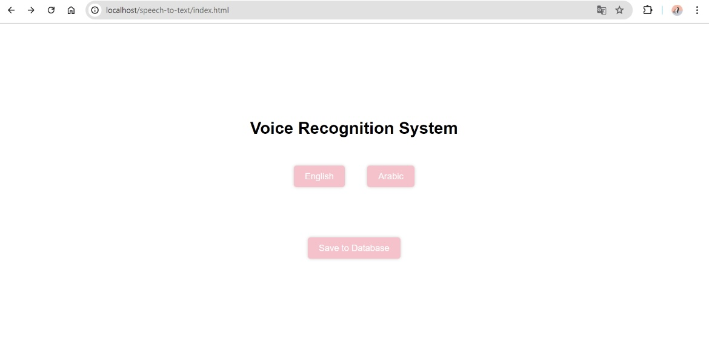
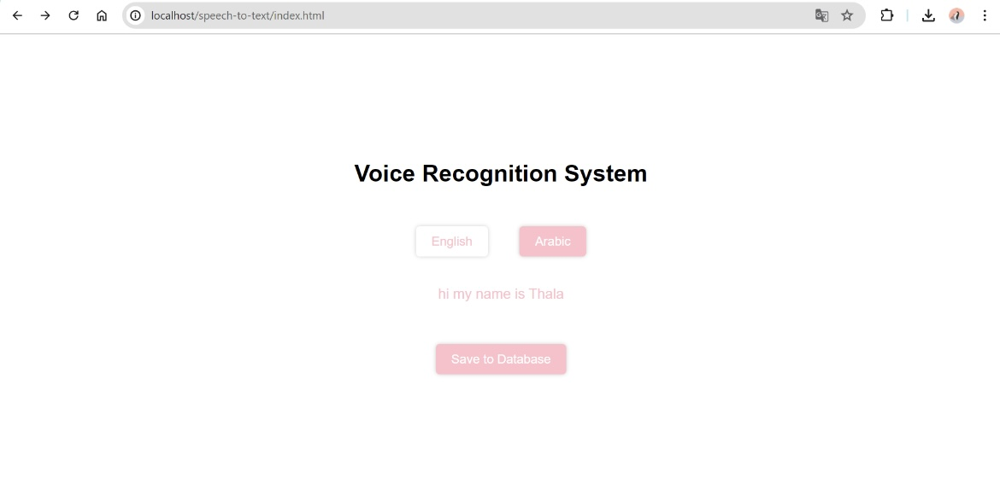
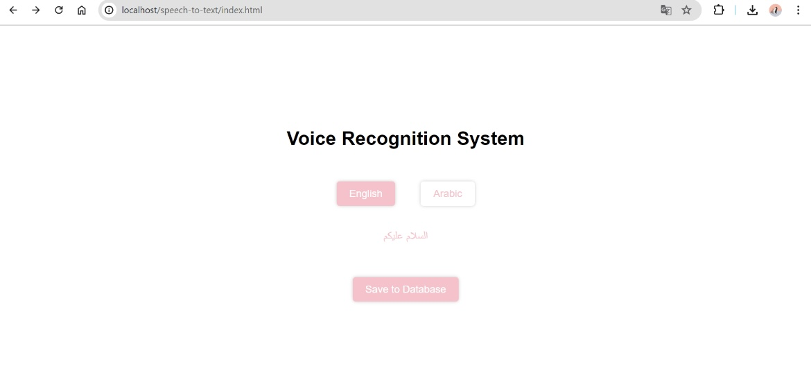
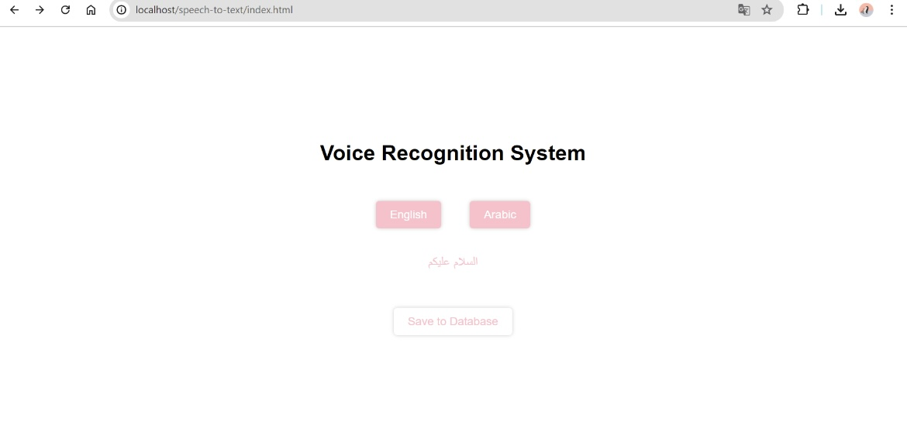
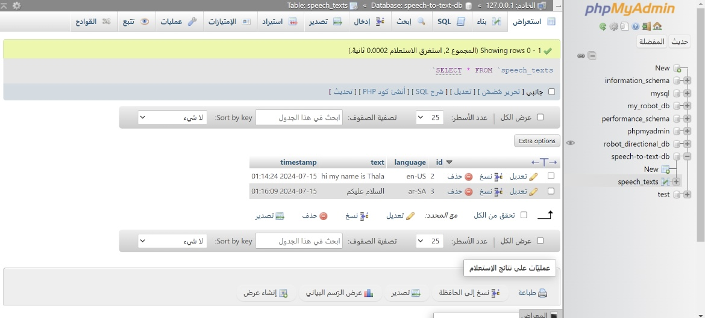

# Convert Voice to Text

The Convert Voice to Text project provides a user-friendly web interface that allows users to seamlessly convert their spoken words into text. Leveraging the capabilities of modern web technologies, this project supports both English and Arabic languages, ensuring a broad user base. The captured text is then efficiently stored in a MySQL database, making it accessible for future reference and analysis.

## Project Setup

### Step 1: Create Project Directory

1. Open XAMPP and navigate to the `htdocs` directory.
2. Create a new folder named `speech-to-text`.
3. Open the folder in VS Code.

### Step 2: Create HTML File

1. Create an `index.html` file in the `speech-to-text` directory.
2. The HTML file creates a window with two buttons for language selection (English, Arabic) and a button to save the data to the database.



### Step 3: Create CSS File

1. Create a `style.css` file in the `speech-to-text` directory.
2. This file designs the window.

### Step 4: Create JavaScript File

1. Create a `script.js` file in the `speech-to-text` directory.
2. This file controls the listening and saving of the spoken text.





### Step 5: Create PHP File

1. Create a `save_text.php` file in the `speech-to-text` directory.
2. This file saves the text to the database.



### Step 6: Create Database and Table

1. Open phpMyAdmin.
2. Create a database named `speech_to_text_db`.
3. Create a table named `speech_texts` with the following structure:

```sql
CREATE TABLE IF NOT EXISTS speech_texts (
    id INT AUTO_INCREMENT PRIMARY KEY,
    language VARCHAR(255) NOT NULL,
    text TEXT NOT NULL,
    timestamp TIMESTAMP DEFAULT CURRENT_TIMESTAMP
);
```


### Link
Access the live project at http://localhost/speech-to-text/index.html and explore the capabilities of real-time voice-to-text conversion.

